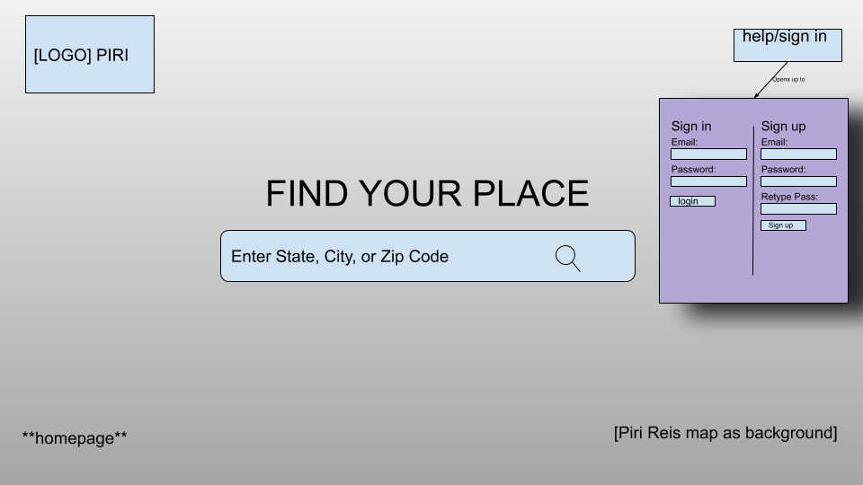

# Project Planning
For this assignment, you'll create some initial plans for your project.

## Assignment Description
[Project Planning Assignment](https://education.launchcode.org/liftoff/modules/assignments/project-planning)

## Submission Instructions

### Wireframes

Include at least 3 wireframes here, adding images or files to your repository as necessary. Format them as a bulleted/unordered list with links to the files.
<ul>
  <li></li>
 </ul>

### Project Tracker

<a href="https://trello.com/b/rdzXKTzs/liftoff-capstone-project"> PIRI PROJECT TRELLO BOARD</a>

### Project Repo Link

<a href="https://github.com/LaunchCodeLiftoffProjects/Piri">PIRI GITHUB PAGE</a>
